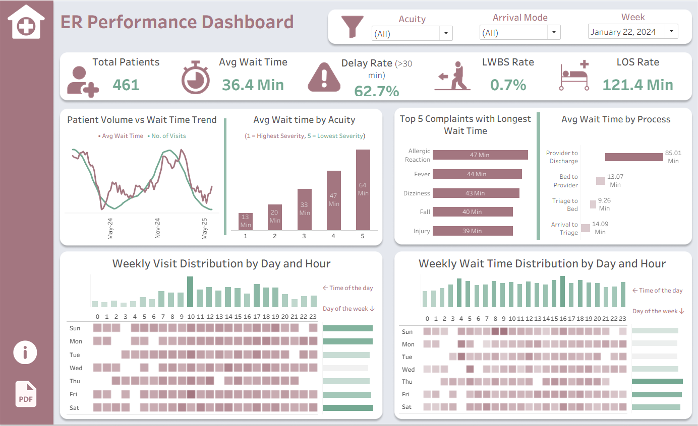

# Emergency Room Performance Dashboard

## Problem
Emergency departments handle high patient volume with limited resources. This leads to long wait times, delays before provider contact, and inefficient patient flow. It is difficult to identify where delays occur and which factors contribute the most.

## Objective
The goal of this project was to build an analytics pipeline and dashboard to:
- Measure patient wait time and length of stay  
- Identify bottlenecks in the ER journey  
- Analyze peak hours and patient volume patterns  
- Understand how different factors impact delays  

## Data
The dataset includes:
- One row per ER visit  
- Patient details such as age group, gender, and risk flags  
- Provider and department information  
- Timestamps from arrival to discharge  

## Approach
Data processing and transformations were performed using Databricks notebooks with PySpark and SQL.

### Data Preparation
- Standardized arrival modes and categorical fields  
- Parsed and validated timestamps  
- Removed duplicate records  
- Designed data with privacy in mind  

### Data Modeling
- Built a star schema for efficient analysis  
- Fact_ER_Visit stores visit level data  
- Fact_Followup captures follow up outcomes  
- Dimension tables provide context for patient, provider, and department  

### Architecture
This project follows a layered data architecture using Databricks:
- Bronze Layer  
  Raw ER data ingested from source systems (event logs, patient, provider data)
- Silver Layer  
  Data cleaned, validated, and transformed for consistency
- Gold Layer  
  Fact and dimension tables created for analytical use (star schema)
- Data Mart  
  Final curated datasets used for reporting and dashboards
Databricks was used to manage data processing and transformations across these layers.

## Reporting Layer
Two datasets were created:

- Visit Level Dataset  
  Used for KPIs, trends, and overall performance  

- Process Level Dataset  
  Used for step wise analysis of triage, bed, provider, and discharge  

This separation helps analyze both high level trends and detailed bottlenecks.

## Key Insights
- Peak evening hours show highest wait time and length of stay  
- Bed assignment step contributes most to overall delay  
- Walk in patients wait longer than ambulance arrivals  
- Higher patient volume leads to longer wait time and delays  

## Tools Used
- Databricks (PySpark, SQL)  
- Tableau  
- Python  
- Excel   

## Dashboard

## Data Model

## Architecture

## Use Case
This solution helps hospital teams identify delays, improve patient flow, and optimize staffing and resource planning.
